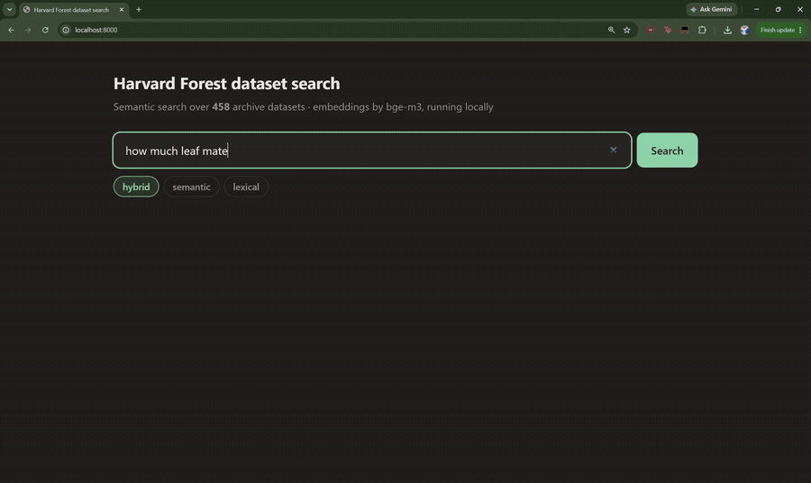

# Harvard Forest Search: Semantic + Lexical
Run a powerful, hybrid search engine over all 458 datasets in the [Harvard Forest data archive](https://harvardforest.fas.harvard.edu/harvard-forest-data-archive),—locally on your own machine. 
## The Problem
The official archive search is frustrating. Finding data requires guessing IDs, digging through prose landing pages, and repeating the process endlessly.
## The Solution
This project fixes the archive's search experience by bringing it local and making it smart:

* Parses EML metadata for every dataset automatically.
* Embeds the text using bge-m3 via local Ollama.
* Searches conceptually, letting you find what you need using natural language.



The archive has a poor search experience. You guess an ID, open a landing page,
read prose, repeat. This project reads every dataset's EML metadata, embeds it
with `bge-m3` through a local Ollama, and lets you ask for what you want in
whatever words you happen to use.

The clip above is one query — *"how much leaf material falls each autumn"* —
with the engine toggled from **hybrid** to **lexical**. Nobody in the archive
writes it that way; they write *litterfall*:

```
hybrid   ->  hf151  Litterfall at Harvard Forest HEM and LPH Towers
lexical  ->  hf342  Gene Expression and Tree Growth
             hf178  Stream Suspended Sediment and Particulate Organic Matter
```

Keyword search returns a gene-expression study and stream sediment. That gap is
the entire point of the project.

See **[DEMO.md](DEMO.md)** for captured terminal output from a real run.

---

## What it is

Three search engines over the same corpus, so you can see the difference:

| engine | how | good at | bad at |
|---|---|---|---|
| **lexical** | field-weighted TF-IDF | exact identifiers — `hf206`, `par_ac_down` | anything paraphrased |
| **semantic** | `bge-m3` vectors, cosine | meaning, loose phrasing | precise identifiers |
| **hybrid** | rank fusion of both | normal questions | nothing in particular |

Measured recall@5 on 17 hand-written queries:

| engine | natural phrasing | adversarial paraphrase |
|---|---|---|
| lexical | 0.90 | **0.00** |
| semantic | 0.90 | **0.43** |
| **hybrid** | **1.00** | 0.29 |

Use **hybrid** for normal questions. Use **semantic** when phrasing loosely —
lexical contributes noise when it has nothing to contribute, which is why hybrid
scores below semantic on paraphrase.

---

## Running it

Needs Python 3.10+, and [Ollama](https://ollama.com) to embed your query.

```bash
pip install -r requirements.txt        # numpy, scikit-learn. that is all
ollama pull bge-m3                     # 1.08 GB, one time

python -m hf_search.server             # -> http://localhost:8000
```

The dataset vectors are **prebuilt and committed** (`data/embeddings.npy`,
1.9 MB), so nothing needs re-embedding. Ollama is only for turning *your query*
into a vector.

Command line, if you prefer:

```bash
python -m hf_search.hybrid "understory light sensors"
python -m hf_search.hybrid --mode semantic "sunlight under the trees"
python -m hf_search.benchmark            # reproduce the table above
```

Lexical mode needs no model at all and works offline.

### Rebuilding from the archive

```bash
python -m hf_search.harvest             # refetch 458 EML files (throttled)
python -m hf_search.semantic --build    # re-embed, ~40 s
```

---

## How it works

1. **`harvest.py`** fetches `hfNNN.xml` from the archive — cached, resumable,
   2 requests/second.
2. **`eml.py`** parses EML 2.2.0 into records: abstract, keywords, coverage,
   section-titled methods, and per-table attributes with declared units.
3. **`corpus.py`** builds the text each engine indexes. The two engines get
   *different* text, deliberately — see below.
4. **`lexical.py`** / **`semantic.py`** / **`hybrid.py`** are the engines.
5. **`server.py`** is a stdlib `http.server` serving one HTML page and one JSON
   endpoint. No framework, no build step.

---

## Known limits

- Casual phrasing still misses. *"How much sunlight reaches the forest floor"*
  does not find hf206, and *"cloudy versus clear sky sunlight split"* does not
  find hf249 — under any engine. `bge-m3` handles domain vocabulary well and
  colloquial paraphrase poorly on this corpus.
- Retrieval is sensitive to wording: hf375 is rank 1 for "plot coordinates
  latitude longitude" and absent for "where are the plots located".
- 17 hand-written queries is a small evaluation set. Treat single points
  sceptically; the tables are directional.
  
### Other limitations

**Cross-encoder reranking made it worse.** The literature calls this the single
highest-impact retrieval component (+17.2 pp MRR@3 reported elsewhere). Here,
`bge-reranker-v2-m3` over the top 30 moved hand-written natural from 1.00 → 0.90
and paraphrase from 0.29 → 0.14, at **8.9 s per query** on CPU. It helped
prose-shaped queries (+0.176 r@1) and hurt keyword-shaped ones (−0.125), which
roughly cancelled. Not shipped.

**Column-level embeddings lost to dataset-level.** Embedding each of the 13,445
attribute definitions separately and promoting a dataset by its best-matching
column lost on 6 of 7 paraphrase queries. Short column texts score
systematically high against short queries, so an unrelated dataset's stray
column outranks the right dataset's. This trick *does* help TF-IDF — it is in
`lexical.py` — and does not transfer to a dense encoder.

**Folding column definitions into the lexical document dropped recall@5 from
0.90 to 0.80.** hf206's 344 definitions span soil moisture, wind, air and soil
temperature; adding them dilutes any one signal and TF-IDF's length
normalisation then penalises the document for being long. So the lexical and
semantic engines index different text — the dense encoder benefits from those
same definitions (0.43 vs 0.14 on paraphrase without them).

**Score-level blending of the two engines failed.** Attribute and dataset
cosines live on different scales; any fixed weight drowns one signal or the
other. Hybrid fuses *ranks*, which never requires the scales to be comparable.

**The auto-derived benchmark flatters lexical.** `benchmark.py --auto` generates
1,360 queries from each dataset's own keywords, title and abstract. TF-IDF
scores 0.94 recall@5 there and 0.00 on hand-written paraphrase — because the
auto queries are literal excerpts of the indexed text. Only the `title` family,
where distinctive words are stripped, is a fair cross-engine comparison. The
large set is useful for detecting regressions within one engine, not for ranking
engines against each other.

---

## Data and licence

Dataset metadata comes from the Harvard Forest Data Archive and is **CC0**.
`data/records.json` is the parsed EML; `data/embeddings.npy` is derived from it.
Raw XML is not committed — `harvest.py` refetches it.

Code is MIT. See [LICENSE](LICENSE).

If you use the underlying data, cite the individual datasets, not this tool.
